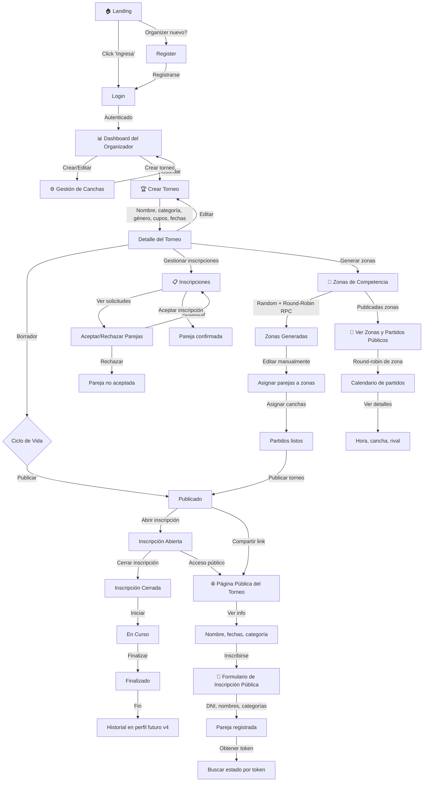

# MatchUp App

Plataforma web para la comunidad de padel orientada a organizadores y jugadores, con enfoque inicial en auto-gestión de torneos.

## Visión

MatchUp es una plataforma diseñada para que los dueños de establecimientos de padel puedan:
- Crear y gestionar torneos completos
- Administrar inscripciones de parejas
- Organizar zonas (grupos) de competencia
- Asignar canchas a los partidos
- Publicar información del torneo para jugadores

En futuras versiones, los jugadores tendrán perfiles personales con historial, estadísticas y rankings.

## Stack tecnológico

- **Frontend**: Next.js 16 (App Router) + TypeScript + React 19
- **Estilos**: Tailwind CSS + shadcn/ui + @base-ui/react
- **Componentes**: react-day-picker (calendar), lucide-react (iconos)
- **Validación**: react-hook-form 7 + Zod 4
- **Base de datos**: Supabase (PostgreSQL)
- **Autenticación**: Supabase Auth
- **Deploy**: Cloudflare Pages
- **Tema**: Azul profesional (#3B82F6) sobre azul noche, token-based

## Requisitos previos

- Node.js v24.16.0+ (con npm 11.x)
- Cuenta Supabase con variables de entorno configuradas

## Instalación

```bash
# Instalar dependencias
npm install

# Configurar variables de entorno
# Copiar .env.example y completar con credenciales Supabase
cp .env.example .env.local
```

## Desarrollo

```bash
# Servidor de desarrollo (ejecuta en puerto 3000)
npm run dev

# Linting del código
npm run lint

# Build de producción
npm run build

# Servir build de producción localmente
npm run start

# Aplicar migraciones SQL pendientes a Supabase
npm run db:apply

# Cargar data fake en un torneo (testing)
npm run seed:registrations -- <tournament-id> [num-pairs]
```

## Estructura del proyecto

```
matchpoint-app/
│
├── src/                                    ┌─────────────────────────────────┐
│   │                                       │  FRONTEND LAYER                 │
│   ├── app/                  # App Router  │  Next.js Pages & Layouts        │
│   │   ├── (auth)/           # Login/Signup
│   │   ├── dashboard/        # Organizer Dashboard
│   │   ├── courts/           # Court Management
│   │   ├── tournaments/      # Tournament CRUD
│   │   │   ├── [id]/
│   │   │   │   ├── edit/
│   │   │   │   ├── zones/    # Zone Management
│   │   │   │   ├── registrations/
│   │   │   │   └── page.tsx
│   │   │   └── new/
│   │   ├── t/[tournamentId]/ # Public Tournament Area
│   │   │   ├── zones/
│   │   │   └── page.tsx
│   │   ├── inscription/[token]/ # Public Registration Check
│   │   ├── layout.tsx
│   │   ├── proxy.ts          # Auth Middleware
│   │   └── globals.css       # Theme & Global Styles
│   │                                       │
│   ├── components/           # Reusable UI  │  COMPONENT LAYER
│   │   ├── ui/               # Base UI (button, calendar, spinner)
│   │   ├── form/             # Form Fields (text, date, segmented)
│   │   ├── auth/             # Auth Components (sign-out)
│   │   ├── courts/           # Court Components
│   │   ├── tournaments/      # Tournament Components
│   │   ├── zones/            # Zone Management Components
│   │   ├── public/           # Public Area Components
│   │   │   ├── pair-registration-form
│   │   │   └── inscription-status-card
│   │   └── organizer/        # Organizer Header
│   │                                       │
│   ├── lib/                  # Business Logic └─────────────────────────────────┘
│   │   ├── supabase/
│   │   │   ├── client.ts     # Browser client (anon key)
│   │   │   ├── server.ts     # SSR client (cookies)
│   │   │   ├── admin.ts      # Service role (server-only)
│   │   │   ├── auth.ts       # Auth helpers
│   │   │   └── proxy.ts      # Middleware logic
│   │   │
│   │   ├── domain/           # Business logic functions
│   │   │   ├── court.ts
│   │   │   ├── tournament.ts
│   │   │   ├── zone.ts
│   │   │   └── pair.ts
│   │   │
│   │   ├── public/           # Public API logic
│   │   │   ├── tournament.ts
│   │   │   ├── zones.ts
│   │   │   └── inscription.ts
│   │   │
│   │   ├── validation/       # Zod schemas
│   │   │   ├── auth.ts
│   │   │   ├── court.ts
│   │   │   ├── tournament.ts
│   │   │   └── registration.ts
│   │   │
│   │   ├── types/
│   │   │   └── database.ts   # TypeScript types from DB
│   │   │
│   │   ├── utils.ts          # Utility functions
│   │   └── format.ts         # Formatting helpers
│   │
│   └── proxy.ts              # Authentication Middleware
│
├── supabase/
│   └── migrations/           # SQL migration files
│
├── scripts/
│   └── apply-migrations.mjs  # DB migration runner
│
├── public/                   # Static assets
│
├── .next/                    # Build output (not in repo)
├── node_modules/             # Dependencies (not in repo)
│
├── CLAUDE.md                 # Development guide
├── spec.md                   # v1 Technical Spec
├── spec-v2.md                # v2 Technical Spec
├── functional-doc.md         # Functional Analysis
├── README.md                 # This file
├── package.json
├── tsconfig.json
├── next.config.ts
├── tailwind.config.ts
└── eslint.config.mjs

┌─────────────────────────────────────────┐
│  DATA LAYER (Supabase PostgreSQL)       │
├─────────────────────────────────────────┤
│ Tables:                                 │
│  • organizer, court                     │
│  • tournament, zone, match              │
│  • pair, player                         │
│  • registration                         │
│                                         │
│ Views (Public):                         │
│  • public_tournament_view                │
│  • public_pair_view                      │
│  • public_court_view                     │
│  • public_organizer_view                 │
│                                         │
│ Functions:                              │
│  • register_pair (SECURITY DEFINER)      │
│  • remove_pair (SECURITY DEFINER)        │
│  • owns_tournament (RLS helper)          │
│  • zone generation (round-robin RPC)     │
│                                         │
│ Security:                               │
│  • RLS enabled on all tables             │
│  • Role-based access (anon/auth)         │
└─────────────────────────────────────────┘
```

## Características implementadas (v1 — MVP)

### Organizer
- ✅ Registro e inicio de sesión
- ✅ CRUD de canchas (outdoor/indoor)
- ✅ Creación de torneos con:
  - Categorías (Individual 1ra-8va o Suma)
  - Género (Masculino, Femenino, Mixto)
  - Gestión de cupos y fechas
- ✅ Ciclo de vida completo del torneo
- ✅ Gestión de inscripciones (aceptar/rechazar/remover parejas)
- ✅ Generación automática de zonas (round-robin)
- ✅ Modificación manual de zonas antes de publicar
- ✅ Asignación opcional de cancha a partidos

### Jugadores (inscripción pública)
- ✅ Formulario de inscripción de pareja sin login
- ✅ Consulta de estado por token único (sin autenticación)
- ✅ Visualización de zonas y partidos (una vez publicados)

## Características implementadas (v2)

- ✅ Calendario público del organizador (URL estática por establecimiento + QR imprimible)
- ✅ Anti-duplicado de inscripción por email dentro de un torneo
- ✅ Resultados / scoring de partidos (configurable por torneo: games o best of 3 sets)
- ✅ Standings / posiciones de zona + formatos de partido (round-robin / ganador-vs-perdedor / manual)
- ✅ Fase de llaves / bracket (siembra configurable + byes automáticos + progresión)
- ✅ Refinamientos de UI/UX en zonas: filtro por zona en la vista pública; tarjetas de partido
  compactas y sección "Partidos" separada de parejas/posiciones en el manager del organizador
- ⏸️ Seguimiento en vivo (Realtime): **postergado** por decisión de producto (ver `spec-v2.md` → Feature 6)

## Flujo de uso de la aplicación



**Flujo de roles principales:**
- **Organizer**: Login → Crear/editar torneos → Gestionar canchas → Procesar inscripciones → Generar zonas → Publicar
- **Pareja (público)**: Ver torneo publicado → Inscribirse → Consultar estado por token → Ver zonas y partidos

## Convenciones de implementación

### Acceso a datos
- **Área protegida**: Server Actions (`src/app/<ruta>/actions.ts`) con autenticación obligatoria
- **Área pública**: Vistas SQL seguras + RPCs SECURITY DEFINER que validan reglas en base de datos
- **Protección de rutas**: Validación en proxy + revalidación en cada página

### Validación
- React Hook Form 7 + Zod 4 + @hookform/resolvers
- Validación tanto en cliente como en servidor

### Base de datos
- RLS (Row Level Security) activo en todas las tablas
- Migraciones en `supabase/migrations/`
- Tokens únicos generados con `gen_random_uuid()`

## Modelo de datos clave

- **Organizer**: Dueño del establecimiento, tiene login y crea torneos
- **Court**: Cancha física del organizador (outdoor/indoor)
- **Tournament**: Evento con categoría, género y cupos
- **Pair**: Pareja de jugadores (unidad de inscripción)
- **Player**: Jugador individual (se guardará sin login en v1 para vinculación futura)
- **Zone**: Grupo de parejas en formato round-robin
- **Match**: Partido entre dos parejas dentro de una zona

## Ciclo de vida del torneo

```
Borrador → Publicado → Inscripción abierta → Inscripción cerrada → En curso → Finalizado
```

Las transiciones son unidireccionales.

## Próximas versiones

- **v2** (en curso, ver `spec-v2.md`): calendario público + QR, anti-duplicado por email, resultados/scoring, standings de zona, bracket — **implementados**. Seguimiento en vivo (Realtime) **postergado**.
- **v3**: Notificaciones y transmisión en vivo
- **v4**: Login y perfiles de jugador con estadísticas y rankings
- **v5**: Gestión avanzada de disponibilidad de canchas y pagos

## Variables de entorno requeridas

```
# Supabase
NEXT_PUBLIC_SUPABASE_URL=<url-del-proyecto>
NEXT_PUBLIC_SUPABASE_ANON_KEY=<clave-publica>
SUPABASE_SERVICE_ROLE_KEY=<clave-privada>
```

## Referencias internas

- `CLAUDE.md` — Instrucciones detalladas para desarrollo
- `spec.md` — Especificación técnica de v1
- `spec-v2.md` — Especificación técnica de v2
- `functional-doc.md` — Análisis funcional completo
